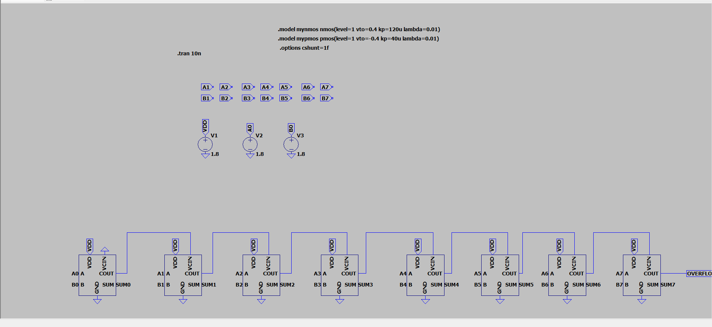
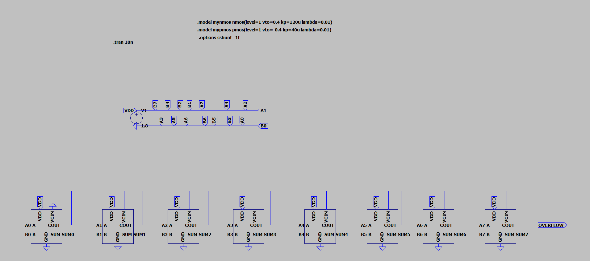

# Custom CMOS 8-Bit Arithmetic Logic Unit (ALU)

## Overview
A fully custom, low-power 8-bit Ripple Carry Adder built entirely from the transistor level up using LTspice. This project bypasses standard logic gates to define custom PMOS and NMOS threshold physics, optimizing for transistor count and simulation stability. Programmed by Ayush Tiwari.

## Architecture & Hierarchy
This ALU was designed modularly, proving the physics at each stage before scaling up:
1. **Transistor Level:** Defined custom `.model` parameters to eliminate threshold leakage.
2. **NAND Core:** A 4-transistor foundational block.
3. **XOR Core:** Built entirely from the custom NAND gates to ensure uniform logic.
4. **1-Bit Full Adder:** Optimized using **De Morgan's Laws**. Instead of the textbook 18-transistor AND/OR architecture, the Carry-Out is built using 3 NAND gates, saving 6 transistors per bit.
5. **8-Bit ALU:** 8 daisy-chained Full Adders forming a Ripple Carry architecture with an Overflow flag.

## Mathematical Verification (Static Testing)
The architecture was verified using static DC inputs to eliminate pulsing simulation delays. 

* **Test 1 (Basic Addition):** `1 + 1 = 2`
  * Inputs: `A0` High, `B0` High. All others grounded.
  * Output Verified: `SUM1` High, `SUM0` Low (Binary `00000010`).
  *  *(Note: Ensure your image link matches the exact filename)*

* **Test 2 (Overflow Stress Test):** `150 + 150 = 300`
  * Inputs: `10010110` + `10010110`.
  * Output Verified: `OVERFLOW` flag triggered successfully. Remainder evaluated to `00101100` (Decimal 44).
  * 

## Tools Used
* LTspice (Schematic capture and SPICE simulation)

* **Programmer: Gopi Rajak**
* **Branch: EE VLSI Design and Technology**
