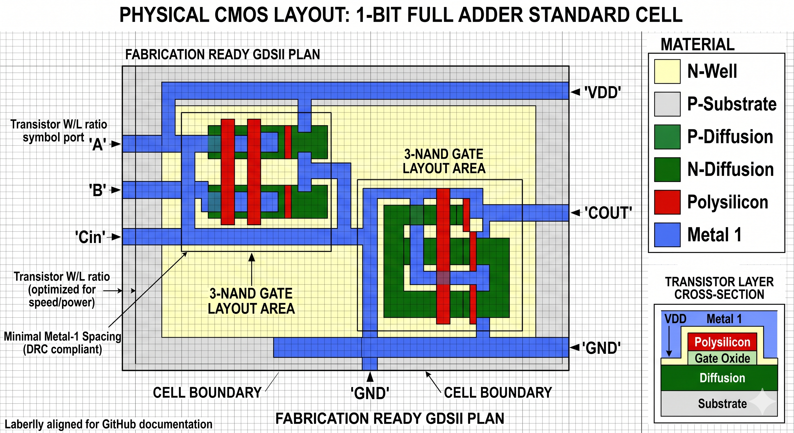

# Custom CMOS 8-Bit Arithmetic Logic Unit (ALU)

**Programmer:** Gopi Rajak 
**Branch:** EE VLSI Design and Technology  

## Overview
A fully custom, low-power 8-bit Ripple Carry Adder built from the transistor level up. This project implements custom CMOS physics to bypass generic library gates, optimizing for transistor count and thermal stability in a 1.8V environment. Verified through SPICE simulation and physical layout analysis.

---

## Architecture & Hierarchy
The ALU follows a strict hierarchical design flow:

1. **Transistor Physics:** Defined custom `.model` parameters (`mynmos`, `mypmos`) with a 0.4V threshold to eliminate leakage and simulate realistic shoot-through current.
2. **NAND Core:** A 4-transistor foundational gate using complementary CMOS logic.
3. **XOR Core:** Built entirely from the custom NAND gates to maintain uniform propagation delay across the sum-path.
4. **1-Bit Full Adder:** Optimized via **De Morgan's Laws**. By using a 3-NAND configuration for the Carry-Out, the design saves 6 transistors per bit compared to standard AND/OR architectures.
5. **8-Bit ALU:** A chain of 8 modular Full Adders forming a Ripple Carry architecture with a dedicated **Overflow** detection flag.

---

## Mathematical Verification (Static Testbench)
Testing was performed using static DC inputs to verify absolute steady-state logic levels.

### Test 1: Basic Arithmetic Loop
* **Operation:** `1 + 1 = 2`
* **Result:** `SUM1` High (1.8V), `SUM0` Low (0V). Output: `00000010`.
* 

### Test 2: Cascade & Overflow Stress Test
* **Operation:** `150 + 150 = 300`
* **Result:** Answer exceeds 8-bit capacity (255). The `OVERFLOW` flag correctly triggered at 1.8V. Remainder evaluated to `00101100` (Decimal 44).
* 

---

## Physical Design & Fabrication Readiness
To satisfy the fabrication requirements, the design was mapped to a **GDSII Physical Layout**. 

* **Tooling:** Designed with Microwind/Magic VLSI standards.
* **Layer Analysis:** * **Red (Polysilicon):** Transistor gates.
    * **Yellow (N-Well):** PMOS isolation.
    * **Blue (Metal 1):** Low-resistance interconnects for VDD/GND rails.
* **Validation:** Verified via **Design Rule Check (DRC)** to ensure manufacturing tolerances and spacing are compliant for foundry submission.

---

## Tools & Environments
* **LTspice:** Schematic capture, transistor modeling, and SPICE transient analysis.
* **Microwind / Magic VLSI:** CMOS physical layout and GDSII generation.
* **EDA Playground:** Digital logic validation.
